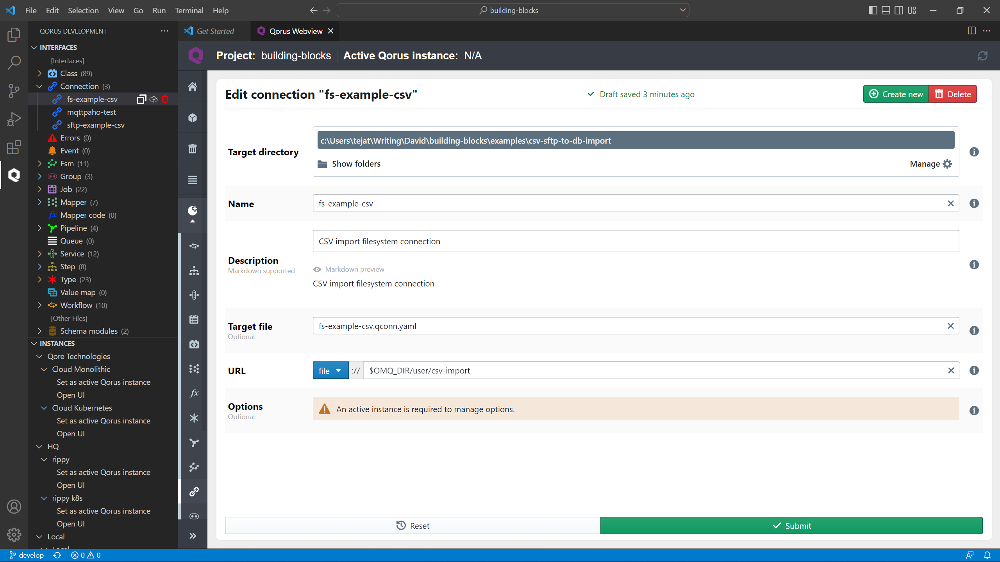
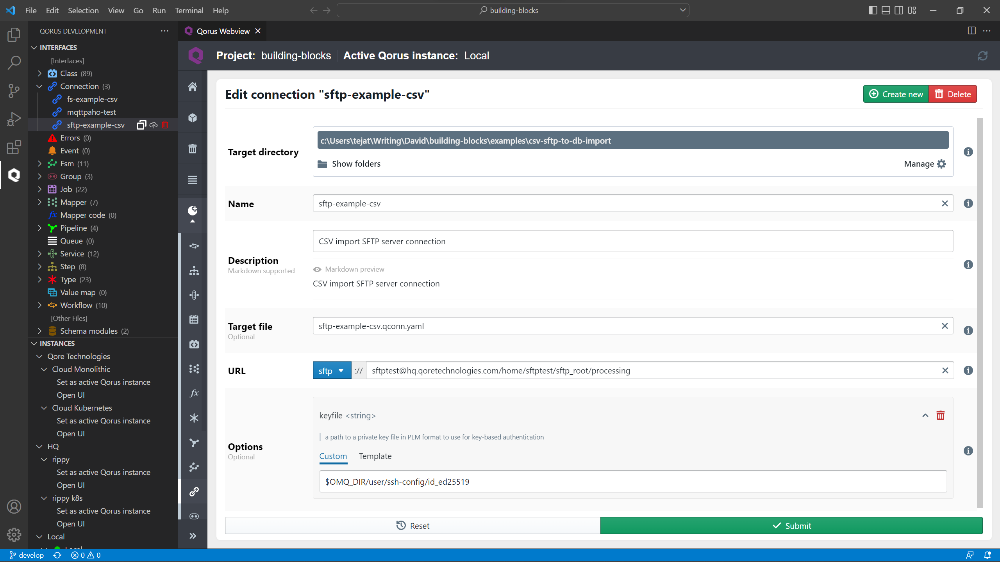
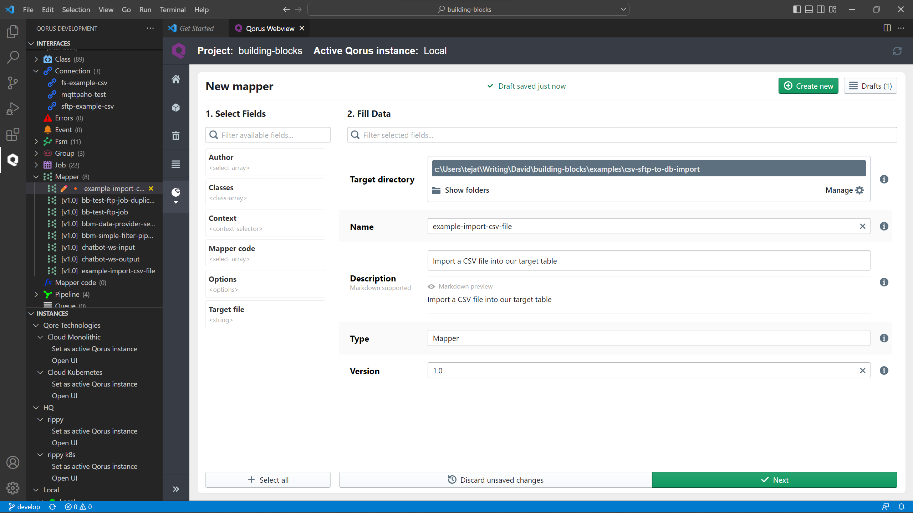
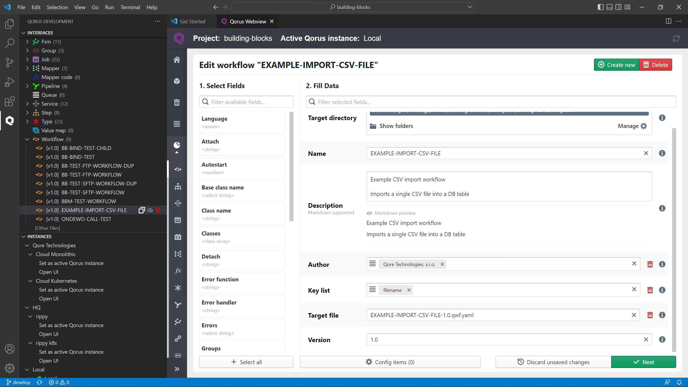
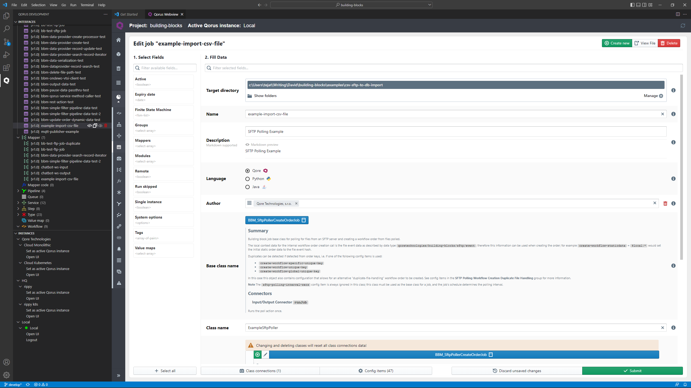
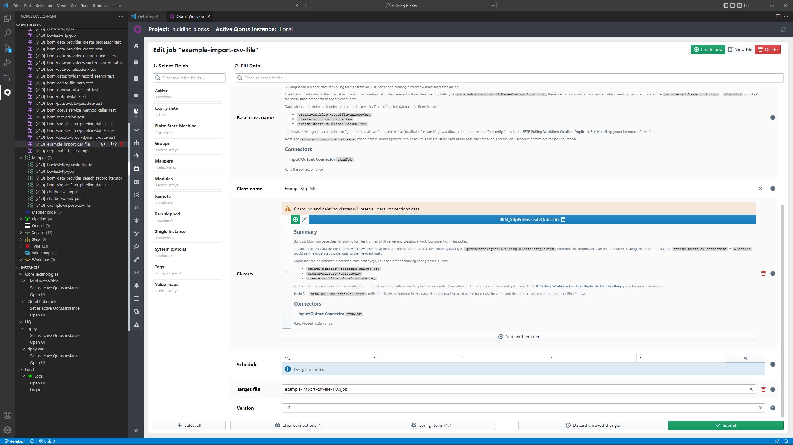

# Polling SFTP Server For CSV Files and Populating its Contents to a DB Table

In this blog post, you'll learn to poll SFTP server for CSV files to read its contents into a DB table.

At Qore technologies we offer integration as a service and provide a complete integration solution. Contrary to other low-code/no-code Rapid Application Development(RAD) tools, Qore is a code/no-code platform. Meaning, It offers a complete no-code approach to all your data integration needs while also providing the freedom of writing your own custom blocks with custom functionality when you see fit.

As such, this blog takes a complete no-code approach to achieve today's objective.

## Requirements

* A local Qorus environment
* [Qorus Developer Tools](https://marketplace.visualstudio.com/items?itemName=qoretechnologies.qorus-vscode) extension for Visual Studio Code
* [Qorus python client](https://github.com/qoretechnologies/qorus-remote)
* A running SFTP server
* A Database table to write the data to

## Getting Started

You'll get started by cloning our building-blocks repository which contains all the required components/blocks to set you up on a no-code approach to data integration.

Clone the repository by

``` cli command
git clone https://git.qoretechnologies.com/qorus/building-blocks.git
```

The source to achieving this blog's goal is already made available in the `examples/csv-sftp-to-db-import` of the building-blocks repository. You'll walkthrough the process involved in creating this solution.

Now that you've met all the requirements, let's poll an SFTP server for CSV files and populate its contents to a DB table using the Qorus interface. You achieve that by the following:

1. [Creating a local file system connection](#creating-a-local-file-system-connection)

2. [Creating an SFTP connection](#creating-an-sftp-connection)

3. [Creating a mapper to map the data from the CSV file to the database](#creating-a-mapper-to-map-the-data-from-the-csv-file-to-the-database)

4. [Creating a workflow to process the CSV file into the DB](#creating-a-workflow-to-process-the-csv-file-into-the-db)

5. [Creating an SFTP polling job that polls the SFTP server every 5 minutes and transfers all CSV files to the local directory](#create-an-sftp-polling-job)

> ℹ️ Note: This demonstration assumes a host running windows

## Creating a Local File System Connection

1. Click on the purple "Q" to get the extension main menu and log in to your Qorus server by clicking on the power button.

2. Click on the `Create new` (new file) icon next to the __Connection__ interface from the interface hierarchy view.

3. In the Qorus Webview window, fill the new connection form to configure the connection.

   1. `Target Directory` : Click on __Show folders__ and select a source directory. This will be the directory where the code generated by the interface is stored.

   2. `Name` : `fs-example-csv` This will be the name of our connection.

   3. `Description` : `CSV import file system connection` The description field supports markdown so, feel free to format your text in markdown.

   4. `URL` : `file://$OMQ_DIR/user/csv-import` The URL should point to the top of the CSV filesystem hierarchy.
   The directory on the __(docker-compose dir)\omq\user\csv-import__ is __$OMQ_DIR/user/csv-import__ (i.e. __/opt/qorus/user/csv-import__) in the Docker container.

   

4. Deploy the new connection to the Qorus server by clicking on the cloud icon next to the connection name in the hierarchy view.

> ℹ️ Note : You can achieve the same by deploying the `fs-example-csv` connection to the server or with `oload` using the [Python client](https://github.com/qoretechnologies/qorus-remote)

## Creating an SFTP Connection

Create an SFTP connection to the SFTP server and the interface directory on it:

1. Click on the `Create new` (new file) icon next to the __Connection__ interface from the interface hierarchy view.

2. In the Qorus Webview window, fill the new connection form to configure the connection.

   1. `Target Directory` : Click on __Show folders__ and select a source directory. This will be the directory where the code generated by the interface is stored.

   2. `Name` : `sftp-example-csv` This will be the name of our connection.

   3. `Description` : `CSV import SFTP server connection` The description field supports markdown so, feel free to format your text in markdown.

   4. `URL` : `sftp://sftptest@hq.qoretechnologies.com/home/sftptest/sftp_root/processing` points to the SFTP server and interface directory on it.

   5. Go to the `Options` field and click on the __Add option__ button to add a key file. In the __Custom__ tab of the keyfile, enter a path to a private key file in PEM format to use for key-based authentication.
       `Options` - `keyfile` : `$OMQ_DIR/user/ssh-config/id_ed25519`

   

3. Deploy the new connection to the Qorus server by clicking on the cloud icon next to the connection name in the hierarchy view.

> ℹ️ Note : You can achieve the same by deploying the `sftp-example-csv` connection to the server or with `oload` using the [Python client](https://github.com/qoretechnologies/qorus-remote)

## Creating a mapper to map the data from the CSV file to the database

1. Click on the `Create new` (new file) icon next to the __Mapper__ interface from the interface hierarchy view.

2. In the Qorus Webview window, fill the new mapper's __Fill Data__ form with the following:

   1. `Target Directory` : Click on __Show folders__ and select a source directory. This will be the directory where the code generated by the interface is stored.

   2. `Name` : `example-import-csv-file` This will be the name of our mapper.

   3. `Description` : `Import a CSV file into our target table` The description field supports markdown so, feel free to format your text in markdown.

   4. `Version` : `1.0`

   5. You can set an optional `Target file` field to name the code file that will be saved in your `Target Directory`. From the __Select Fields__ list to the left of __Fill Data__ form, click  on the __plus__ button next to `Target file`. Now, populate it with a filename `Target file` : `example-import-csv-file-1.0.qmapper.yaml`

   

3. Click __Next__ to create the mapper

4. Click on the __Please select__ button next to the `Select input` field and then, select __factory__ from the list

5. Click on the __Please select__ button next to the `Select input` field again, and select __csvread__, the CSV reader data provider for the factory.

6. Now Click on the __Add options__ button below the __Select input__ field and add the following __Factory options__

   1. Add the `path` option, then go to the __Template__ tab and click on the dropdown labeled __Please select__. Select 'static' from the dropdown and enter 'filename' for the key.

       `path` : `$static:filename`. This will be the full path to the CSV.

   2. Click on __Add options__ and add the `header_names` option and set its value to true.

       `header_names` : `true`

   3. Add the `fields` option and enter the following in __Custom__ tab.

       `fields` :

       ``` yaml
       StoreCode: string
       ProductCode: string
       ProductDescription: string
       Available: int
       Ordered: int
       InTransit: int
       ReportDate: date
       ```

       These values describe  the input fields in the CSV

7. Click on the __Please select__ button next to the `Select output` field and then, select __datasource__ from the list.

8. Click on the __Please select__ button next to the `Select output` field again, and then select __omquser__ from the list.

9. Click on the __Please select__ button next to the `Select output` field one last time and select __inventory_example__ from the list.

10. Create the following mappings

    * StoreCode -> store_code
    * ProductCode -> product_code
    * ProductDescription -> product_desc
    * Available -> available
    * Ordered -> ordered
    * InTransit -> in_transit
    * ReportDate -> report_date

11. Now click on the programmatic output, `</>` symbol on the following output fields to edit:

    * id: select `sequence` -> `seq_inventory_example` (the name of the sequence to be used to populate the field)

    * filename: select `context` -> `$keys:filename` (the workflow order key "filename" will be used to populate the field)

    * uuid: select `context` -> `$static:uuid` (the uuid key from workflow static data will be used to populate the field)

    * total: select `context` -> `$qore-expr:{$local:input.Ordered + $local:input.InTransit}`

    * qorus_wfiid: select `context` -> `$local:workflow_instanceid`

12. Deploy the mapper to the Qorus server by clicking on the cloud icon next to the mapper name in the hierarchy view.

> ℹ️ Note : You can achieve the same by deploying the `example-import-csv-file` mapper to the server or with `oload` using the [Python client](https://github.com/qoretechnologies/qorus-remote)

## Creating a workflow to process the CSV file into the DB

Create a workflow in the IDE which is responsible for processing the CSV file into the DB.

> ℹ️ Note: Workflow is a stateful IT orchestration object. Even though the current solution has no orchestration in this interface. we utilise the unique keys for workflow orders as the file name to ensure that we process each CSV file only once.

1. Click on the `Create new` (new file) icon next to the __Workflow__ interface from the interface hierarchy view.

2. In the Qorus Webview window, fill the new workflow's __Fill Data__ form with the following:

   1. `Target Directory` : Click on __Show folders__ and select a source directory. This will be the directory where the code generate by interface is stored.

   2. `Name` : `EXAMPLE-IMPORT-CSV-FILE` This will be the name of our workflow.

   3. `Description` : `Example CSV import workflow` The description field supports markdown so, feel free to format your text in markdown.

   4. `Version` : `1.0`

   5. From the __Select Fields__ list to the left of __Fill Data__ form, click  on the __plus__ button next to `Key list` field and populate it with

       `Key list` : `filename`

3. Click __Next__ to create a single workflow step for this workflow that will actually do the job.

4. To create a new step into the DB table, click on __Add new step at the beginning / Add new step at the end__, then click on the __plus__ button next to the __step__ field.

5. In the Qorus Webview window, fill the new step's __Fill Data__ form with the following:

   1. `Target Directory` : Click on __Show folders__ and select a source directory. This will be the directory where the code generate by interface is stored.

   2. `Name` : `ExampleImportCsvFile` This will be the name of our object.

   3. `Description` : `Import a CSV file into our target table` The description field supports markdown so, feel free to format your text in markdown.

   4. Click on __Please select__ button next to the `Base class name` field and select `QorusNormalStep`, The abstract class for normal steps.

       `Base class name` : `QorusNormalStep`

   5. `Class name` : `ExampleImportCsvFile`

   6. `Version` : `1.0`

6. From the __Select Fields__ list to the left of __Fill Data__ form, click  on the plus button next to `Finite State Machine`. This FSM is responsible for parsing the CSV file and saving it in the DB.

7. Click on the __plus__ button in the `Finite State Machine` field in the __Fill Data__ form and populate with the following.

   1. `Target Directory` : Click on __Show folders__ and select a source directory. This will be the directory where the code generated by the interface is stored.

   2. `Name` : `example-import-csv-file` This will be the name of our FSM

   3. `Description` : `Import a CSV file into our target table` The description field supports markdown so, feel free to format your text in markdown.

   4. Drag and drop the __Connector__ object into the diagram window and fill the resulting form with the following:

       * `Name` : `Import CSV to DB`

       * `Initial` : `true`

       * Click on the __plus__ button in the `Action value` field and select `BBM_AutoMapper`

           > ℹ️ Note : All class objects that start with "BBM" in their name are part of the Qorus's building blocks. Each object/block has its own functionality that can be arranged in a certain logic to accomplish a particular task providing a complete no-code approach to data integration. As such, You can also code a custom object/block to accomplish a custom task or write your version of an already existing building block.

       * Click on the __Please select__ dropdown and select `runMapper`

       * Click on the __Config items__ button at the bottom and then, on the __Add new value__ button. Click on the __Please select__ drop down and select `automapper-mapper-name` and set its value to `example-import-csv-file`

           `automapper-mapper-name` : `example-import-csv-file`

       * Close the config item manager and click __Submit__ to save the state.

   5. Click on __Submit__ to save and close the FSM

8. Click on the __plus__ button in the `Finite State Machine` field of the __Fill Data__ form. In the __Trigger Manager__ select `Trigger`. Click on the __please select__ dropdown and select `primary`

9. From the __Select Fields__ list to the left of __Fill Data__ form, click  on the plus button next to `Mappers` to add a mapper. In the search bar search and select `example-import-csv-file:1.0`

10. Click __Submit__ on the step to save the step

11. Click __Submit__ to save the workflow

12. Deploy the workflow to the Qorus server by clicking on the cloud icon next to the workflow name in the hierarchy view. When prompted, click on `Yes - with all dependencies`



> ℹ️ Note: You can achieve the same by deploying the `EXAMPLE-IMPORT-CSV-FILE` workflow to the server with all dependencies or deploy the following files with `oload` using the [Python client](https://github.com/qoretechnologies/qorus-remote):
>`EXAMPLE-IMPORT-CSV-FILE-1-1.0.qwf.yaml` 
> `example-import-csv-file-1.0.qmapper.yaml`
> `ExampleImportCsvFile-1.0.qstep.yaml` 
> `example-import-csv-file.qfsm.yaml`

## Create an SFTP Polling Job

Create an SFTP polling job in the IDE that polls the SFTP server every five minutes and transfers all CSV files to the local in-process directory.

1. Click on the `Create new` (new file) icon next to the __Job__ interface from the interface hierarchy view.

2. In the Qorus Webview window, fill the new jobs's __Fill Data__ form with the following:

   1. `Target Directory` : Click on __Show folders__ and select a source directory. This will be the directory where the code generated by the interface is stored.

   2. `Name` : `example-import-csv-file` This will be the name of our job

   3. `Description` : `SFTP Polling Example` The description field supports markdown so, feel free to format your text in markdown.

   4. Click on the __PLease select__ button in the `Base class name` and select `BBM_SftpPollerCreateOrderJob`

   5. `Class name` : `ExampleSftpPoller`

   6. Populate the `Schedule` field with the following:

       * Minute : */5

       * Hours : *

       * Day : *

       * Month : *

       * Weekday : *

   7. `Version` : `1.0`

   8. From the __Select Fields__ list to the left of __Fill Data__ form, click  on the plus button next to `Classes` and click on the __please select__ button  and select `BBM_SftpPollerCreateOrderJob`

3. Configure the job by clicking on the `Config items` at the bottom and give the config items the following values:

   1. Click on the __Add new config item__ button and populate the fields in the __Config item editor__ as follows:

       * `Name` : create-work-flow-name

       * `Description` : The name of the workflow

       * `Config group` : Create Workflow Order

       * `Strictly local` : true

       * `Type` : Workflow

       * `Default value` : EXAMPLE-IMPORT-CSV-FILE

   2. Add another config item with the following attributes:

       * `Name` : sftp-polling-connection-name

       * `Description` : Name of the SFTP connection

       * `Config group` : SFTP Polling

       * `Strictly local` : true

       * `Type` : Connection

       * `Default value` : sftp-example-csv

   3. Add another config item with the following attributes:

       * `Name` : sftp-polling-mask

       * `Description` : the filename mask for files to match when polling; is a regular expression if `sftp-polling-mask-regex` is set; if not, then this value is a glob value

       * `Config group` : SFTP Polling

       * `Strictly local` : true

       * `Type` : string

       * `Default value` : *csv

   4. Add another config item with the following attributes:

       * `Name` : sftp-polling-file-connection

       * `Description` : the name of a local file connection where to save files

       * `Config group` : SFTP File Options

       * `Strictly local` : true

       * `Type` : Connection

       * `Can be undefined` : true

       * `Default value` : fs-example-csv

   5. Add another config item with the following attributes:

       * `Name` : sftp-polling-file-name

       * `Description` : a template string giving the target local file name as offset from the connection identified with `sftp-polling-file-connection`; ignored if `sftp-polling-file-connection` is not set; local context includes the event information (ex: `subdir/$local:name`)

       * `Config group` : SFTP File Options

       * `Strictly local` : true

       * `Type` : string

       * `Can be undefined` : true

       * `Default value` : in-process/$local:{name}

   6. Add another config item with the following attributes:

       * `Name` : sftp-polling-file-temp-template

       * `Description` : the template for the temporary filename used while transferring the file, the file event info is added to the local context (ex: the target filename is available as `$local:name`)

       * `Config group` : SFTP Polling Fine Tuning

       * `Strictly local` : true

       * `Type` : string

       * `Default value` : .tmp.$local:{name}.part

   7. Add another config item with the following attributes:

       * `Name` : create-workflow-staticdata

       * `Description` : A hash providing the initial workflow order static data; for resolving template values

       * `Config group` : Create Workflow Order Data

       * `Strictly local` : true

       * `Type` : hash

       * `Can be undefined` : true

       * `Default value` :

           ``` yaml
           filename: $local:input.local_path
           uuid: $qore-expr:{UUID::get()}
           ```

   8. Add another config item with the following attributes:

       * `Name` : create-workflow-unique-key

       * `Description` : An optional hash of order keys that will ensure uniqueness for a particular workflow name (across all versions); the keys in this hash must correspond to registered workflow order keys, the values are one or more key values. These keys can be used to quickly search for workflow order data.

       * `Config group` : Create Workflow Order Keys

       * `Strictly local` : true

       * `Type` : hash

       * `Can be undefined` : true

       * `Default value` :

           ``` yaml
           filename: $local:input.name
           ```

4. Close the __Config Item Manager__ and click on the __Class connections__ at the bottom to create a class connection to run the job logic.

   1. Click on the __Add connection__ button in the __Class Connections Manager__ to add a connection.

   2. click on the edit button on the resulting connection ad rename it to `run`

   3. Click on the `Add initial connector` and populate the fields as follows:

       * `Class` : `BBM_SftpPollerCreateOrderJOb`

       * `Connector` : `runJob`

       * `Trigger` : `run`

       * Click __Submit__ button to save

5. Click `Submit` to save the connection

6. Deploy the new job to the Qorus server by clicking on the cloud icon next to the jab name in the hierarchy view. When prompted click on the `Yes - with all dependencies`





> ℹ️ Note : You can achieve the same by deploying the `example-import-csv-file` job to the server or with `oload` using the [Python client](https://github.com/qoretechnologies/qorus-remote)

## Verify Your Installation and Deployment

1. Go to the Qorus operational web interface at https://localhost:8011 and verify that the workflow `EXAMPLE-IMPORT-CSV-FILE` and the job `example-import-csv-file` are both running.

2. Check the sftp `sftp-example-csv` and filesystem `fs-example-csv` connections to make sure they are up / working.

## Testing the solution

1. Copy the example file `StockReport-b88a43eb-4cdd-46c2-8d64-4b26bd3aed64.csv` in the `examples\csv-sftp-to-db-import\example-files` directory to the SFTP directory by:

   ``` cli command
   scp -i [path-to-your-private-key] -oIdentitiesOnly=true StockReport-b88a43eb-4cdd-46c2-8d64-4b26bd3aed64.csv sftptest@hq.qoretechnologies.com:sftp_root/processing
   ```

2. check the log file of the example-import-csv-file job to ensure that the file is polled and retrieved and the workflow order for it is created

3. you can also check the job results for the job to see that its status is COMPLETE

4. then check the workflow EXAMPLE-IMPORT-CSV-FILE to ensure that the order was processed. The order should have a COMPLETE status

5. you can also verify the data in the target DB with the following command (using the Python client): qdp omquser/inventory_example search - which should output the 10 rows written to the inventory_example table in the omquser datasource (datasource for generic user use - in the Docker image its set up pointing to the same datasource as the Qorus system datasource, so please do not manipulate any other tables in that datasource)

## Retrying

To retry and run a test scenario again, you need to delete the workflow orders for the `EXAMPLE-IMPORT-CSV-FILE` workflow, since we have a unique key for the CSV file; the rows need to be deleted from the target table - the following commands (using the Python client) will do this:

* `oload -Xwfinstances:EXAMPLE-IMPORT-CSV-FILE:1.0` (deletes all orders for the workflow)

* `qdp omquser/inventory_example del` (deletes all rows in the interface table)

> ℹ️ Note: you can create a new file with a new file name to avoid deleting rows in the interface table.
