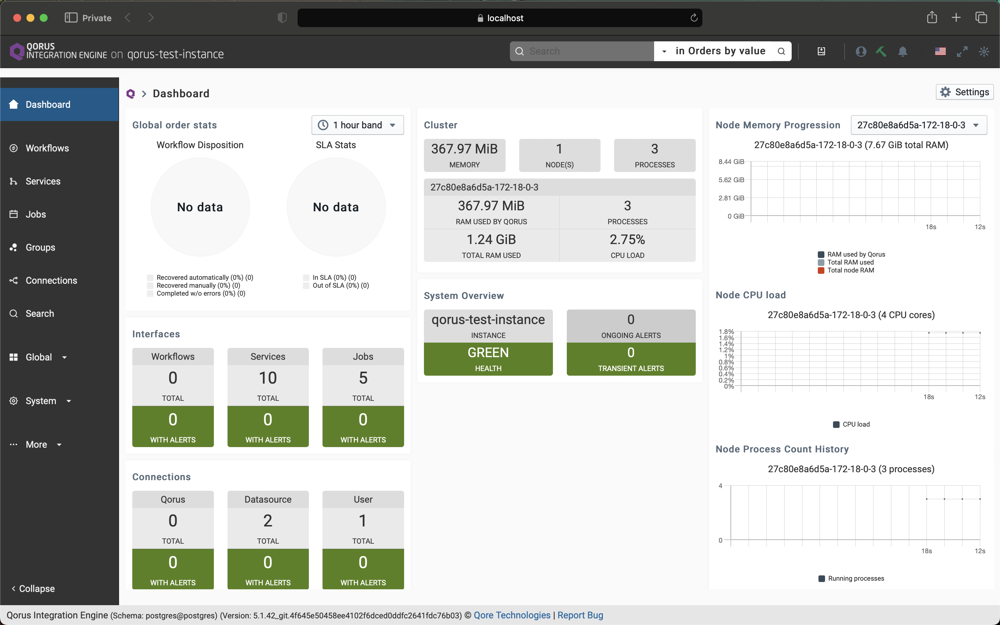
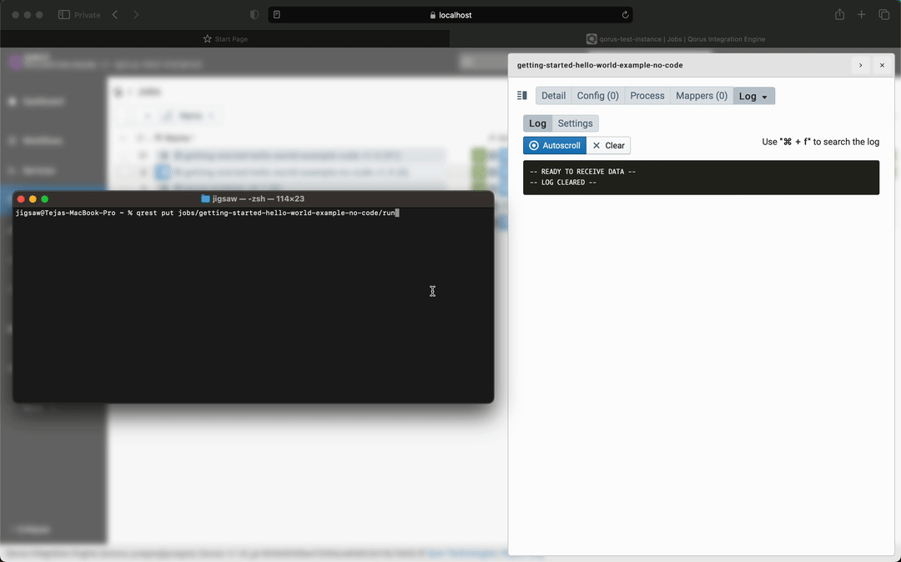
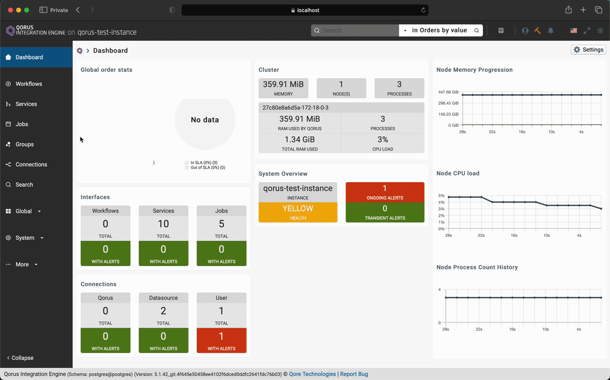
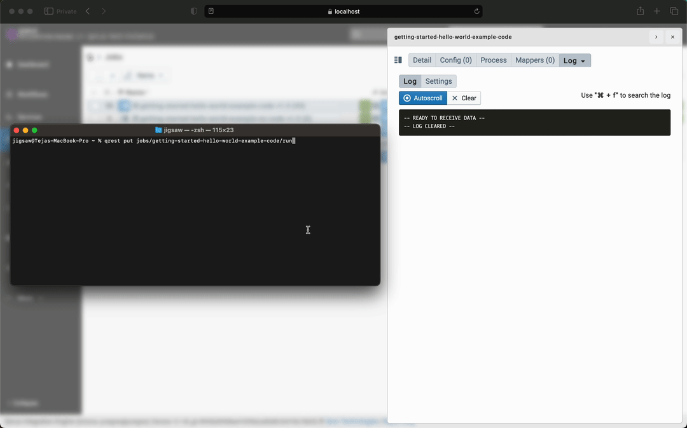

# Getting Started With Qorus

In this blog, you'll learn how to get Qorus up and running. You'll get started by learning how to run a Qorus image in a Docker container. Then, you'll learn how to communicate with remote Qorus instances, and finally, you'll test your setup by implementing a "Hello, world" example.

## Requirements

* [git](https://git-scm.com/book/en/v2/Getting-Started-Installing-Git)
* [Docker](https://www.docker.com)
* A Qorus image for Docker
* [Python3, pip](https://www.python.org/downloads/)
* [qorus-remote](https://github.com/qoretechnologies/qorus-remote) - our python client to communicate with remote Qorus instances
* [Qorus Developer Tools](https://marketplace.visualstudio.com/items?itemName=qoretechnologies.qorus-vscode) extension for Visual Studio Code

## Running Qorus in Docker

1. Clone our __qorus-docker__ repository with:

    ``` git
    git clone https://git.qoretechnologies.com/qorus/qorus-docker.git
    ```

2. Change the directory to get to Qorus's Docker compose file.

    ``` cli command
    cd qorus-docker/docker
    ```

3. Pull and build the Qorus image with

    ``` cli command
    docker-compose up -d
    ```

This will create a PostgreSQL database schema for Qorus, and local volumes for persistent data. Qorus will start with an HTTPS listener on port `8011` with RBAC disabled.

With RBAC disabled, you can connect to Qorus by visiting https://localhost:8011 without authentication. There, you'll have access to the Qorus dashboard.



> ℹ️ Note: Your browser might issue a security warning when trying to reach Qorus at `localhost:8011`. This is because Qorus is running with a self-signed certificate. You can safely ignore this warning.

## Logging With Qorus

Qorus has a robust logging system. By default, the logs are written to the `/opt/qorus/log` directory in the Docker container. To set up a basic configuration with a 90-day data retention period and DB purging of older data as well as daily log rotation; bz2 archiving in the arch subdirectory, and 90-day log file retention, run the `first_time_install.sh` script.

The `first_time_install.sh` script is located in the `/opt/qorus/bin` directory on the Docker container. You can execute this script from the host machine by:

``` cli command
docker exec [Qorus CONTAINER ID] bash --login -c first_time_install.sh 
```

You should see the following output after successful execution:

``` cli command
first_time_install.sh: set config item arch.day-interval
first_time_install.sh: enabled the qorus-archiver job
first_time_install.sh: enabled the qorus-log-rotator job
first_time_install.sh: changes made; archiving and log rotation are enabled
```

## Communicating With Remote Qorus Instances

Qorus comes with a Python client package __(qorus-remote)__ for working with remote Qorus instances. qorus-remote provisions the execution of command-line programs on remote Qorus servers and for the output to be displayed locally in real time. The means of this communication are the REST API and the WebSocket protocol. Therefore, you can use the command line as well as the IDE to work with Qorus.

Install qorus-remote with:

``` cli commant
pip install qorus-remote
```

> ℹ️ Note: On Linux, sometimes pip installs executables into a custom directory; in these cases, it's necessary to add $HOME/.local/bin to your path in your setup script - i.e. $HOME/.bashrc, or $HOME/.bash_profile ( if you are using zsh then ~/.zprofile or ~/.zshrc )

Now, configure the `.netrc` file to provide the login information required to access a Qorus remote server. For a Qorus server located at https://localhost:8011 and using the Qorus user `adm`, you should have:

``` text
machine localhost
port 8011
secure yes
login adm
password adm
timeout 120
verbose no
```

`.netrc` files are usually placed in the home directory; therefore, write the above contents to a file and save it at:

On Linux and Mac machines:

``` cli command
~/.netrc-qorus-local
```

On Windows:

``` cli commands
%USERPROFILE%\qorus\netrc-qorus-local
```

### Usage

``` cli command
qorus-remote-commands [-h|--help|--usage] <NETRC-FILE> <COMMAND> [<COMMAND-ARGS> ...]
```

A few of the commands possible with `qorus-remote`:

* [`oload`](https://qoretechnologies.com/manual/qorus/current/qorus/commandline.html#oload) - loads sources and configuration into the Qorus server.

* [`qctl`](https://qoretechnologies.com/manual/qorus/current/qorus/commandline.html#qctl) - main interface for the qorus cluster.

* [`qrest`](https://qoretechnologies.com/manual/qorus/current/qorus/commandline.html#qrest) - the command-line REST API interface.

* [`qdp`](https://qoretechnologies.com/manual/qorus/current/qorus/commandline.html#qrest) - the command-line interface to the [Data Provider API](https://qoretechnologies.com/manual/qorus/current/qore/modules/DataProvider/html/index.html#dataproviderintro)

The complete command list is available in our [qorus-remote repository](https://github.com/qoretechnologies/qorus-remote#commands)

### Aliases

It's recommended to create aliases for each of the commands, like:

On Windows Command Prompt

* `DOSKEY oload=qorus-remote-commands %USERPROFILE%\qorus\netrc-qorus-local oload $*`
* `DOSKEY qctl=qorus-remote-commands %USERPROFILE%\qorus\netrc-qorus-local qctl $*`
* `DOSKEY qrest=qorus-remote-commands %USERPROFILE%\qorus\netrc-qorus-local qrest $*`
* `DOSKEY qdp=qorus-remote-commands %USERPROFILE%\qorus\netrc-qorus-local qdp $*`

On Linux and Mac machines

* `alias oload='qorus-remote-commands ~/.netrc-qorus-local oload $*'`
* `alias qctl='qorus-remote-commands ~/.netrc-qorus-local qctl $*'`
* `alias qrest='qorus-remote-commands ~/.netrc-qorus-local qrest $*'`
* `alias qdp='qorus-remote-commands ~/.netrc-qorus-local qdp $*'`

and so on...

After setting aliases, you can test the python client __(qorus-remote)__ by:

* `qctl ps` -  get a list of cluster processes
* `qctl threads qorus-core` - get a list of thread stacks for the `qorus-core`  process
* `oload -Ls` - lists the services installed in the database
* `qrest system/instance-key` -  returns the system [instance key](https://qoretechnologies.com/manual/qorus/current/qorus/systemoptions.html#instance-key) name from the REST API (configured in `$OMQ_DIR/etc/options`  - change requires a restart)

> ℹ️ Note: `$OMQ_DIR`  refers to the `/opt/qorus` on the Docker container. On linux/mac host this is `(docker compose file directory)/omq/user` directory, and on windows host `(docker compose file directory)\omq\user` directory. *docker compose file directory* is the directory from which you ran the `docker-compose up -d` instruction earlier.

## Setup Qorus IDE

1. Fire up your VS Code, then install the [Qorus Developer Tools](https://marketplace.visualstudio.com/items?itemName=qoretechnologies.qorus-vscode) extension.

2. Clone our building-blocks repository by:

    ```cli command
    git clone https://git.qoretechnologies.com/qorus/building-blocks.git
    ```

    > ℹ️ Note: Building blocks are intended to provide reusable elements for solving technical challenges in a generic manner, reducing development effort and, ideally, eliminating development and transforming the delivery of complex functionality to simple configuration.

3. Open the building-blocks directory in  VS Code. The source for __hello world__ example is already available in `examples/HelloWorld`.

4. Click on the Qorus Development Extention, then click on the purple "Q" icon to get the extension main menu. Connect to your __local Qorus server__ by clicking on the power button.

    > ℹ️ Note: This is important as some IDE functionality requires an online Qorus connection.  
    > You can change the configuration of an instance by clicking on the `edit` (pen) button next to the power button. Since Qorus is running with RBAC disabled, like we mentioned earlier, the 'Username' and 'Password' fields are empty for your local Qorus instance.


## Implementing the Hello World Example

To code or not to code

What separates Qorus from other Rapid Application Development (RAD) tools like low-code/no-code platforms is that Qorus is a code/no-code platform, it's a "no-code platform for coders". In other words, it provides a complete no-code solution to all of your data integration needs while also allowing you to write custom blocks and code solutions that can be packaged as self-documenting, reusable building blocks.

You'll explore both routes to implementing the "Hello, world" example.

### Source Directories

Qorus organizes objects through sub-directories called source directories, this is where the code generated by Qorus is saved. The IDE will only show objects that are stored in the source directories. To create one for your "Hello, world" example:

1. Click on the purple "Q" icon to get the extension main menu, then click on the `Manage source directories` button.

2. Click on `Show folders` under __Add source directory__

3. Now click on the `green folder with a plus icon` next to the building-blocks directory.

4. Enter a name for the __New subdirectory__, then click on the `Create and add to sources` button

### The No-Code Approach

As you can see from the interface hierarchy view to the left, Qorus classifies its interfaces into various types. You'll be working with the `Fsm`, `Job`, and `Group` interfaces in this example.

`Fsm` - [Finite State Machines](https://qoretechnologies.com/manual/qorus/current/qorus/finite_state_machines.html) allow arbitrary logic to be configured and deployed by connecting integration objects. When existing building blocks are sufficient to cover the implementation requirements, Finite State Machines support complete no-code solutions.

`Job` - [Jobs](https://qoretechnologies.com/manual/qorus/current/qorus/implementingjobs.html) are simple tasks executed on a schedule, similar to a cron job.

`Group` - [Group]( https://qoretechnologies.com/manual/qorus/current/qorus/sysarch.html#rbacgroups) interfaces contain a list of workflows, user services, jobs, mappers, value maps, finite state machines, and data pipelines; groups can be enabled and disabled, and roles can have a list of groups they can access.

### Creating an FSM interface

1. In the interface hierarchy view, click on the `New file` (create new) icon next to the `Fsm` interface.

2. In the Qorus Webview window, fill out the new Finite State Machine form to configure a new `Fsm`.

    1. `Target directory`: Click on __Show folders__ and select the sub-directory you created earlier. This is where the code generated by Qorus will be saved.

    2. `Name`: `getting-started-hello-world` - The name of your new `FSM` will be this.

    3. `Description`: `Fsm for hello world example`

        >ℹ️ Note: The description field supports markdown, so feel free to format your text in markdown.

    4. Drag the __API Call__ block into Qorus' flow designer and enter:

        * `Name`: `Getting started log hello, world!`
        * `Type`: `state`
        * `Initial`: `true`
        * `Action`: `apicall`
        * Click on the __Please select__  button next to the `Action value` field and select `factory`. Click on the __Please select__ button and select `qorus-api`. Do it one more time and select `util`. Do it one last time and select `log-message`
        * Toggle `Allow API Arguments` to `true`
        * Find the `Custom` tab, at the bottom, under the `Arguments` and enter `Hello, world!`
        * Hit the `Submit` button.

    5. Hit the `Submit` button again to save the `Fsm`

3. Deploy the new `Fsm` to the Qorus server by clicking on the cloud icon next to the `Fsm` name in the hierarchy view.

The `qorus-api` Data Provider factory provides the `log-message`  API provider that logs a message according to the arguments. The `qorus-api`  Data Provider Factory is provided by Qorus and provides a set of APIs that can be used in `FSMs` to perform tasks in Qorus. API data providers provide introspection, they can be browsed, and all their arguments and return types are documented and can be viewed in the IDE.


### Creating a Job: A No-Code Approach

1. In the interface hierarchy view, click on the `New file` (create new) icon next to the `Job` interface.

2. In the Qorus Webview window, fill out the new job form to configure a new `job` interface.

    1. `Target directory`: Click on __Show folders__ and select the sub-directory you created earlier. This is where the code generated by Qorus will be saved.

    2. `Name`: `getting-started-hello-world-example-no-code` - The name of your new `Job` will be this.

    3. `Description`: `Just for logs, getting started hello world! no code solution`

        >ℹ️ Note: The description field supports markdown, so feel free to format your text in markdown.

    4. `Base class name`: `QorusJob` - is the abstract Qorus job class

    5. `Class name`: `GettingStartedHelloWorld`

    6. `Schedule` :

        * `Minute`: `0`
        * `Hour`: `1`
        * `Day`: `1`
        * `Month`: `1`
        * `Weekday`: `*`

    7. `Version`: `1.0`

    8. From the Select Fields list to the left of the Fill Data form, click on the plus button next to `Active` field and toggle it `false`

        > ℹ️ Note: In Qorus, jobs usually run on a schedule. Since we want to run our job on demand, we set the `Active` attribute to false. The default setting for this attribute is true.

    9. From the list, add `Groups` and set it to `EXAMPLES`

    10. Now add `Finite State Machine` from the list and click dropdown labled __Please select__ and select the `Fsm` we created earlier, the `getting-started-hello-world` Fsm. Now, click on add a trigger by clicking on the __plus__  under __Triggers__ and fill in the following:

        * `Trigger` : `Trigger`
        * From the __Please select__ dropdown select `run`
        * Hit `Submit`

        >
         ℹ️ Note: Without a trigger, the `Fsm` will not run when you run the job. Though you can run the `Fsm` through an API Call - [`UserApi::executeFsm()`](https://qoretechnologies.com/manual/qorus/current/qorus/classOMQ_1_1UserApi_1_1UserApi.html#a3f095ed1bac457e3e01d525f0bb9300b), with a pure no-code approach, we can setup the job to trigger the `Fsm` and run it automatically.

    11. Hit `Submit` to save the job

3. Deploy the new `Job` to the Qorus server by clicking on the cloud icon next to the `Job` name in the hierarchy view.

> ℹ️ Note: In most cases, both the command-line and the UI can be used for the same tasks.


__Running the job, through UI:__

1. Open a browser and navigate to https://localhost:8011 to be greeted by the Qorus dashboard.

2. Click on the Jobs tab to the left and find the 'getting-started-hello-world-example-no-code' job you created earlier.

3. Hit the __Open side pane__ button to the left of the job's name.

4. Click on the __run__ button under controls to run the job.

5. Go to the __Log__ tab on the side pane to see the log from the job.


__Running the job, through command-line:__

1. Open terminal on the host machine and run:

    ``` cli command
    qrest put jobs/getting-started-hello-world-example-no-code/run
    ```

2. In the side pane, navigate to the "Log" tab to view the job's log.

You should see the following output after successful execution:

``` text
hash: (2 members)
  job_instanceid : 14
  status : "COMPLETE"
```



### Creating a Job: A Code Approach

1. In the interface hierarchy view, click on the `New file` (create new) icon next to the `Job` interface.

2. In the Qorus Webview window, fill out the new job form to configure a new `job` interface.

    1. `Target directory`: Click on __Show folders__ and select the sub-directory you created earlier. This is where the code generated by Qorus will be saved.

    2. `Name`: `getting-started-hello-world-example-code` - The name of your new `Job` will be this.

    3. `Description`: `Just for logs, getting started hello world! code solution`

        >ℹ️ Note: The description field supports markdown, so feel free to format your text in markdown.

    4. `Base class name`: `QorusJob` - is the abstract Qorus job class

    5. `language`: `python`

    6. `Class name`: `GettingStartedHelloWorldExampleCode`

    7. `Schedule` :

        * `Minute`: `0`
        * `Hour`: `1`
        * `Day`: `1`
        * `Month`: `1`
        * `Weekday`: `*`

    8. `Version`: `1.0`

    9. From the Select Fields list to the left of the Fill Data form, click on the plus button next to `Active` field and toggle it `false`

    10. From the list, add `Groups` and set it to `EXAMPLES`

    11. Hit `Submit` to save the job

3. Hitting submit will open the "getting-started-hello-world-example-code-1.0.qjob" file.

    >ℹ️ Note: This file is located in the `Target directory` specified during the new job interface creation. 

4. Add `logInfo("Hello, world! -- code example");` to the `run` function.


__Running the job, through UI:__

1. Open a browser and navigate to https://localhost:8011 to be greeted by the Qorus dashboard.

2. Click on the Jobs tab to the left and find the 'getting-started-hello-world-example-no-code' job you created earlier.

3. Hit the __Open side pane__ button to the left of the job's name.

4. Click on the __run__ button under the controls to run the job.

5. Go to the __Log__ tab on the side pane to see the log for the job.



__Running the job, through the command-line:__

1. Open terminal on the host machine and run:

    ``` cli command
    qrest put jobs/getting-started-hello-world-example-code/run
    ```

2. In the side pane, navigate to the "Log" tab to view the job's log.



You might've observed that the "no-code" version of the example will take more time to implement. However, in cases where a certain IT challenge needs to be solved potentially many times in the future, and possibly by developers unfamiliar with the implementation details, using a "no-code" approach will dramatically reduce the time and cost of future maintenance as well as enabling easy reuse of the solution, whereas a pure code-based approach will take more time, will cost more, and will be subject to higher levels of risk.
